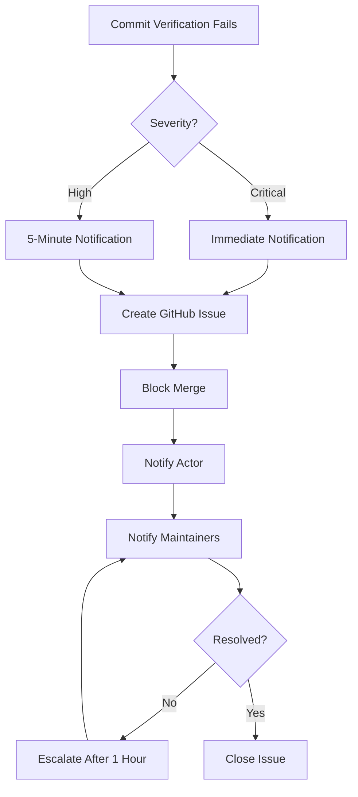
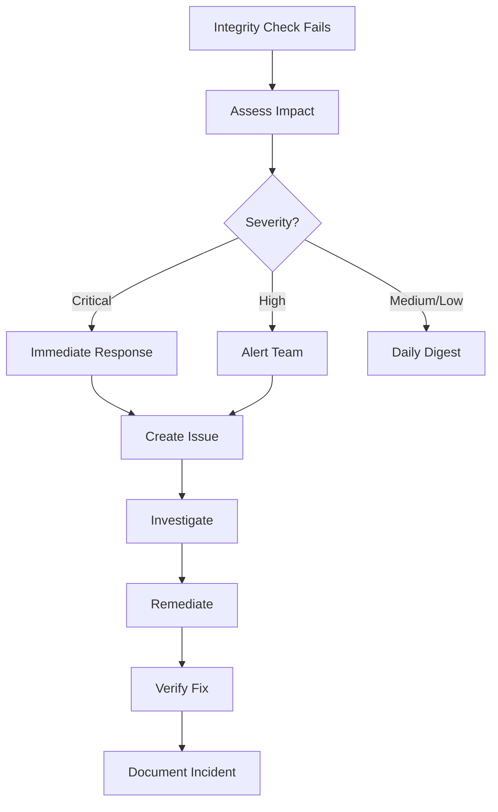
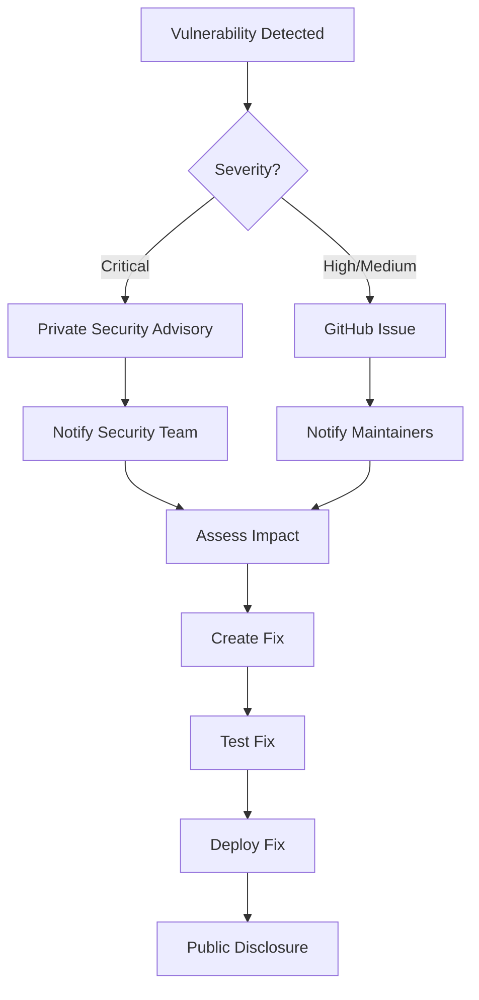

# Notification Protocols

## Overview

The Honesty Framework implements a comprehensive notification system to ensure timely communication of verification failures, integrity issues, and other critical events.

## Notification Principles

### 1. Timeliness
Notifications must be sent within defined time windows based on severity.

### 2. Relevance
Only relevant parties should be notified to avoid alert fatigue.

### 3. Clarity
Notifications must be clear, actionable, and provide necessary context.

### 4. Traceability
All notifications should be logged for audit purposes.

### 5. Escalation
Unresolved issues should escalate automatically.

## Severity Levels

### Critical
**Definition**: Issues that pose immediate security risks or block all development.

**Examples:**
- Malicious code detected
- Critical security vulnerability
- Compromised credentials
- System breach

**Notification Time**: Immediate (< 1 minute)

**Actions:**
- Send immediate notifications
- Create GitHub issue
- Block all merges
- Page on-call engineer
- Escalate to security team

### High
**Definition**: Significant issues that affect code integrity or quality.

**Examples:**
- Commit verification failure
- High-severity security vulnerability
- Integrity violation detected
- Failed critical tests

**Notification Time**: < 5 minutes

**Actions:**
- Send notifications
- Create GitHub issue
- Block affected branches
- Notify maintainers

### Medium
**Definition**: Important issues that should be addressed soon.

**Examples:**
- Medium-severity vulnerabilities
- Code quality issues
- Documentation gaps
- Process deviations

**Notification Time**: Daily digest

**Actions:**
- Include in daily digest
- Track in backlog
- Notify relevant team

### Low
**Definition**: Minor issues that can be addressed in regular workflow.

**Examples:**
- Style violations
- Minor documentation issues
- Low-priority warnings

**Notification Time**: Weekly summary

**Actions:**
- Include in weekly summary
- Track for future improvement

## Notification Channels

### 1. GitHub Notifications

**Primary channel for all severity levels.**

#### GitHub Issues
- Created automatically for Critical and High severity
- Labeled appropriately
- Assigned to relevant parties
- Linked to workflow runs

**Example Critical Issue:**
```markdown
Title: 🚨 CRITICAL: Commit Verification Failed

Labels: critical, verification-failure, honesty-framework

## Critical Verification Failure

**Workflow:** Commit Verification
**Status:** failure
**Branch:** main
**Commit:** abc123def456
**Actor:** @username
**Run URL:** https://github.com/...

This is a critical failure that requires immediate attention.
Please review the workflow run and address the issues.
```

#### Workflow Annotations
- Inline comments on failures
- Error messages with context
- Links to relevant documentation

#### Pull Request Comments
- Automated comments on PR
- Verification status updates
- Required action items

### 2. Email Notifications

**Configuration**: Via GitHub notification settings

**When Used:**
- Critical issues (if configured)
- Weekly summaries
- Monthly reports

**Recipients:**
- Repository watchers
- Issue assignees
- Mentioned users
- Custom distribution lists

### 3. Slack/Teams Integration

**Setup**: Via GitHub Apps or webhooks

**Channels:**
- `#critical-alerts`: Critical issues only
- `#security`: Security-related issues
- `#integrity`: Integrity violations
- `#general-notifications`: All other notifications

**Message Format:**
```
🚨 CRITICAL: Commit Verification Failed

Repository: honesty-framework
Workflow: Commit Verification
Branch: main
Actor: @username

[View Run](workflow_url) | [View Issue](#123)
```

### 4. Status Badges

**Real-time status display in README:**

```markdown
[](workflow_url)
[](workflow_url)
[](workflow_url)
```

**Status Colors:**
- Green: All checks passing
- Yellow: Some warnings
- Red: Failures detected
- Gray: Not run / Unknown

## Notification Content

### Required Information

All notifications must include:

1. **Severity Level**: Critical, High, Medium, Low
2. **Event Type**: What happened
3. **Location**: Repository, branch, commit
4. **Actor**: Who triggered the event
5. **Timestamp**: When it occurred
6. **Details**: Specific information
7. **Action Required**: What needs to be done
8. **Resources**: Links to logs, documentation

### Notification Template

```json
{
  "severity": "CRITICAL",
  "event_type": "commit_verification_failure",
  "repository": "org/repo",
  "branch": "main",
  "commit": "sha",
  "actor": "username",
  "timestamp": "2026-01-18T20:56:00Z",
  "workflow": "Commit Verification",
  "run_url": "https://github.com/.../runs/...",
  "details": {
    "failure_type": "sensitive_data_detected",
    "affected_files": ["config/secrets.yml"],
    "description": "Potential API key found in commit"
  },
  "action_required": "Remove sensitive data and force push clean history",
  "documentation": "https://github.com/.../docs/VERIFICATION_PROCESS.md#sensitive-data"
}
```

## Notification Workflows

### Commit Verification Failure



### Integrity Check Failure



### Security Vulnerability Detected



## Escalation Procedures

### Automatic Escalation

**Triggers:**
- Unresolved Critical issue after 1 hour
- Unresolved High issue after 24 hours
- Repeated failures (3+ in 24 hours)
- Security vulnerabilities not acknowledged

**Escalation Path:**
1. **Level 1**: Initial assignee
2. **Level 2**: Team lead / Maintainer
3. **Level 3**: Project owner
4. **Level 4**: Security team (if security-related)

**Actions:**
- Add escalation label
- Update priority
- Add additional assignees
- Send escalation notification

### Manual Escalation

**Process:**
1. Add `escalation` label to issue
2. Mention `@security` or `@team-lead`
3. Provide context for escalation
4. Set clear timeline for resolution

## Notification Management

### Reducing Noise

**Strategies:**
- Use appropriate severity levels
- Consolidate related notifications
- Implement quiet hours (optional)
- Use digest formats for low priority
- Allow user preferences

**Digest Schedules:**
- Daily Digest: 8 AM local time
- Weekly Summary: Monday 8 AM
- Monthly Report: 1st of month

### Notification Preferences

**User Configuration:**
```yaml
notification_preferences:
  critical: immediate
  high: immediate
  medium: daily_digest
  low: weekly_digest
  
  channels:
    github: true
    email: true
    slack: false
    
  quiet_hours:
    enabled: true
    start: "22:00"
    end: "08:00"
    timezone: "America/Chicago"
```

### Notification Filtering

**Filter by:**
- Severity level
- Event type
- Repository
- Branch
- Actor
- Time period

## Monitoring and Metrics

### Notification Metrics

**Track:**
- Notifications sent (by severity)
- Response time (time to acknowledge)
- Resolution time (time to resolve)
- Escalation rate
- False positive rate

**Goals:**
- Critical: < 1 minute to send, < 15 minutes to acknowledge
- High: < 5 minutes to send, < 1 hour to acknowledge
- Medium: Daily digest, < 1 day to acknowledge
- Low: Weekly digest, tracked in backlog

### Dashboard

**Display:**
- Recent notifications
- Open issues by severity
- Average response times
- Trends over time
- System health status

## Logging and Audit

### Notification Logs

**Log Details:**
```json
{
  "log_id": "uuid",
  "timestamp": "2026-01-18T20:56:00Z",
  "notification_type": "commit_verification_failure",
  "severity": "CRITICAL",
  "repository": "org/repo",
  "recipients": ["user1", "user2"],
  "channels": ["github", "email"],
  "status": "sent",
  "acknowledged_at": "2026-01-18T21:00:00Z",
  "resolved_at": "2026-01-18T21:30:00Z"
}
```

**Retention:**
- Notification logs: 90 days
- Audit logs: 1 year
- Critical incident logs: Indefinite

### Audit Trail

**Maintain records of:**
- All notifications sent
- Acknowledgment times
- Resolution times
- Escalations
- User actions

## Testing and Validation

### Test Notifications

**Regular Testing:**
- Weekly: Send test notification
- Monthly: Full escalation path test
- Quarterly: Disaster recovery drill

**Test Script:**
```bash
# Trigger test notification
gh workflow run notification-system.yml \
  --field test=true \
  --field severity=CRITICAL
```

### Validation

**Verify:**
- Notifications received
- Correct severity
- Appropriate recipients
- Accurate information
- Timely delivery

## Incident Response

### Notification System Failure

**If notification system fails:**

1. **Fallback**: Use secondary channels
2. **Manual**: Send notifications manually
3. **Investigate**: Determine cause
4. **Fix**: Restore service
5. **Verify**: Confirm restoration
6. **Post-Mortem**: Document incident

### Communication During Incidents

**Best Practices:**
- Establish communication cadence
- Use status page
- Provide regular updates
- Be transparent about issues
- Share resolution timeline

## Resources

### Documentation
- [Verification Process](VERIFICATION_PROCESS.md)
- [Integrity Standards](INTEGRITY_STANDARDS.md)
- [Transparency Guidelines](TRANSPARENCY_GUIDELINES.md)

### Configuration Files
- `config/notification-config.yml`
- `.github/workflows/notification-system.yml`

### Support
- GitHub Discussions
- Issue templates
- Maintainer contact

---

**Last Updated**: 2026-01-18
**Version**: 1.0.0
**Maintainers**: Project Team
