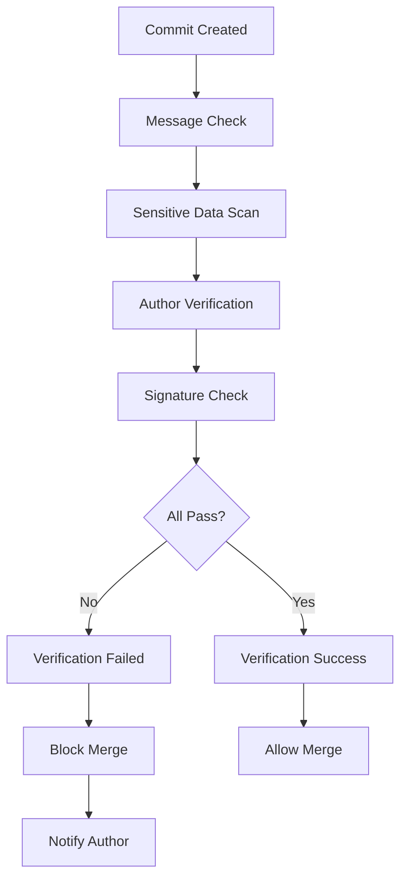
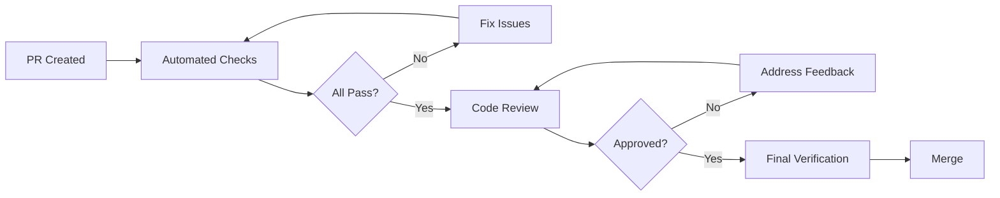

# Verification Process

## Overview

The Honesty Framework implements comprehensive verification processes to ensure code integrity, authenticity, and trustworthiness. This document describes all verification procedures.

## Verification Layers

### 1. Commit Verification

#### Purpose
Validate the integrity and authenticity of every commit to the repository.

#### Automated Checks

**Commit Message Validation**
- Format compliance
- Minimum length requirements
- Issue reference validation
- Conventional commit format

**Sensitive Data Scanning**
- Password detection
- API key scanning
- Secret token identification
- Private key detection
- Environment variable checks

**Author Identity Verification**
- Email format validation
- Author name verification
- Organization membership (if applicable)
- Contributor license agreement status

**Signature Verification**
- GPG signature validation
- SSH signature validation
- Certificate chain verification
- Timestamp verification

#### Workflow



### 2. Integrity Validation

#### Purpose
Ensure the overall integrity of the codebase and detect any unauthorized modifications.

#### Automated Checks

**File Checksum Generation**
```bash
# Generate SHA-256 checksums for all files
find . -type f -not -path './.git/*' -exec sha256sum {} \;
```

**Integrity Monitoring**
- Baseline checksum creation
- Periodic integrity scans
- Change detection
- Anomaly identification

**Dependency Validation**
- Lock file verification
- Version pinning checks
- Supply chain security
- Known vulnerability scanning

**Protected File Monitoring**
- Workflow file changes
- Configuration modifications
- Security policy updates
- Access control changes

#### Schedule

- **On Push**: Every push to any branch
- **On PR**: Every pull request
- **Scheduled**: Daily at 2 AM UTC
- **On Demand**: Manual workflow dispatch

### 3. Code Integrity Checks

#### Purpose
Verify code quality, security, and compliance standards.

#### Static Analysis

**Code Quality**
- Linting (language-specific)
- Style compliance
- Code smell detection
- Complexity analysis

**Security Scanning**
```yaml
Scanners:
  - Trivy: Vulnerability scanning
  - Gitleaks: Secret detection
  - Bandit: Python security (if applicable)
  - Gosec: Go security (if applicable)
```

**License Compliance**
- License file presence
- License header verification
- Dependency license checks
- Attribution validation

**Documentation Completeness**
- README existence
- API documentation coverage
- Code comment density
- Example availability

#### Severity Levels

- **CRITICAL**: Must be fixed immediately
- **HIGH**: Should be fixed before merge
- **MEDIUM**: Should be addressed soon
- **LOW**: Can be addressed in future

## Verification Workflows

### Pre-Commit Verification

#### Local Checks (Recommended)

**Setup Git Hooks**
```bash
# Install pre-commit framework
pip install pre-commit

# Install hooks
pre-commit install

# Run manually
pre-commit run --all-files
```

**Hook Configuration**
```yaml
# .pre-commit-config.yaml
repos:
  - repo: local
    hooks:
      - id: commit-message
        name: Verify Commit Message
        entry: ./scripts/verify-commits.sh
        language: script
        stages: [commit-msg]
      
      - id: secrets-check
        name: Check for Secrets
        entry: gitleaks protect --staged
        language: system
        stages: [commit]
```

### Pull Request Verification

#### Required Checks

1. **Commit Verification**: All commits pass validation
2. **Integrity Check**: No integrity violations detected
3. **Code Integrity**: All code quality checks pass
4. **Security Scan**: No critical vulnerabilities
5. **Documentation**: Documentation updated if needed

#### Review Process



### Post-Merge Verification

#### Continuous Monitoring

**Daily Integrity Scans**
- Full repository scan
- Checksum verification
- Anomaly detection
- Trend analysis

**Periodic Audits**
- Weekly security audits
- Monthly compliance reviews
- Quarterly transparency audits

## Verification Standards

### Commit Standards

#### Message Format

```
<type>(<scope>): <subject>

<body>

<footer>
```

**Types**:
- `feat`: New feature
- `fix`: Bug fix
- `docs`: Documentation
- `style`: Formatting
- `refactor`: Code restructuring
- `test`: Adding tests
- `chore`: Maintenance

**Example**:
```
feat(auth): Add two-factor authentication

Implements TOTP-based 2FA using industry standard.
Users can enable 2FA in their account settings.

Closes #456
Breaking-Change: Requires users to re-authenticate
```

#### Signature Requirements

**Recommended (Not Required)**:
- GPG signing for commits
- SSH signing (GitHub supports)
- S/MIME signing

**Setup GPG Signing**:
```bash
# Generate key
gpg --gen-key

# List keys
gpg --list-secret-keys --keyid-format=long

# Configure git
git config --global user.signingkey YOUR_KEY_ID
git config --global commit.gpgsign true

# Add to GitHub
gpg --armor --export YOUR_KEY_ID
# Paste in GitHub Settings > SSH and GPG keys
```

### Code Standards

#### Quality Metrics

- **Test Coverage**: > 80% (goal)
- **Code Complexity**: < 10 cyclomatic complexity
- **Documentation**: 100% public API documented
- **Security**: 0 critical/high vulnerabilities

#### Compliance Requirements

- **License**: All files have license headers
- **Attribution**: Third-party code attributed
- **Dependencies**: All dependencies approved
- **Security**: Security policy followed

## Handling Verification Failures

### Failure Types

#### 1. Commit Verification Failure

**Symptoms**:
- Commit message format invalid
- Sensitive data detected
- Author identity invalid

**Resolution**:
```bash
# Fix commit message
git commit --amend

# Remove sensitive data
git filter-branch --force --index-filter \
  "git rm --cached --ignore-unmatch PATH/TO/FILE" \
  --prune-empty --tag-name-filter cat -- --all

# Update author
git commit --amend --author="Name <email@example.com>"
```

#### 2. Integrity Violation

**Symptoms**:
- Checksum mismatch
- Unauthorized modifications
- Dependency tampering

**Resolution**:
1. **Investigate**: Determine cause of violation
2. **Assess Impact**: Evaluate security implications
3. **Remediate**: Fix or revert changes
4. **Document**: Create incident report
5. **Prevent**: Update processes to prevent recurrence

#### 3. Code Integrity Failure

**Symptoms**:
- Security vulnerabilities
- Code quality issues
- License violations

**Resolution**:
1. **Prioritize**: Based on severity
2. **Fix**: Address issues
3. **Verify**: Re-run checks
4. **Document**: Update change log

### Notification Process

#### Severity-Based Notifications

**CRITICAL**:
- Immediate notification
- Create tracking issue
- Block all merges
- Notify security team

**HIGH**:
- Notification within 5 minutes
- Create tracking issue
- Block affected branches
- Notify maintainers

**MEDIUM**:
- Daily digest
- Track in backlog
- Address in next sprint

**LOW**:
- Weekly summary
- Track for future improvement

## Verification Tools

### Recommended Tools

#### Commit Verification
- **commitlint**: Commit message linting
- **git-secrets**: Prevent committing secrets
- **gitleaks**: Detect secrets in git history

#### Integrity Checking
- **sha256sum**: File checksum generation
- **git-fsck**: Git filesystem check
- **aide**: Advanced Intrusion Detection

#### Security Scanning
- **Trivy**: Vulnerability scanning
- **Snyk**: Dependency scanning
- **Dependabot**: Automated dependency updates
- **CodeQL**: Semantic code analysis

#### Code Quality
- **ShellCheck**: Shell script analysis
- **ESLint**: JavaScript linting
- **Pylint**: Python linting
- **Golangci-lint**: Go linting

### Tool Configuration

See the `/config` directory for tool configurations:
- `config/integrity-rules.yml`
- `config/verification-config.yml`

## Verification Reports

### Report Types

#### 1. Commit Verification Report
- Commit details
- Verification results
- Issues identified
- Recommendations

#### 2. Integrity Check Report
- Scan timestamp
- Files checked
- Violations found
- Remediation steps

#### 3. Code Integrity Report
- Analysis results
- Security findings
- Quality metrics
- Compliance status

### Report Storage

Reports are stored as GitHub Actions artifacts:
- **Retention**: 90 days
- **Access**: Repository collaborators
- **Format**: Markdown and JSON

## Continuous Improvement

### Metrics Tracking

- **Verification Success Rate**: Target 100%
- **Mean Time to Detection**: Target < 5 minutes
- **False Positive Rate**: Target < 5%
- **Coverage**: Target 100% of changes verified

### Review Cycle

1. **Weekly**: Review failure trends
2. **Monthly**: Analyze metrics
3. **Quarterly**: Update verification standards
4. **Annually**: Comprehensive audit

## Getting Help

### Resources

- [Transparency Guidelines](TRANSPARENCY_GUIDELINES.md)
- [Integrity Standards](INTEGRITY_STANDARDS.md)
- [Notification Protocols](NOTIFICATION_PROTOCOLS.md)

### Support Channels

- **Questions**: GitHub Discussions
- **Issues**: Create an issue with appropriate template
- **Urgent**: Contact repository maintainers

---

**Last Updated**: 2026-01-18
**Version**: 1.0.0
**Maintainers**: Project Team
